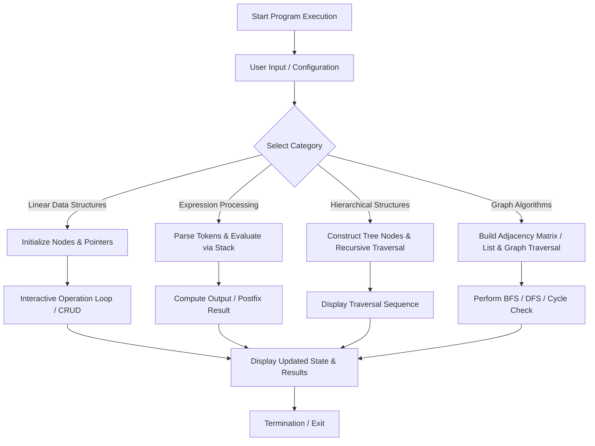

# Data Structures and Algorithms in Python

A structured collection of foundational Data Structures and Algorithms implemented from scratch in Python, featuring interactive command-line interfaces, explicit pointer manipulation, expression parsers, and graph traversal algorithms.

---

## Table of Contents

- [Overview](#overview)
- [Repository Structure](#repository-structure)
- [Project Workflow](#project-workflow)
  - [High-Level Execution Flow](#high-level-execution-flow)
  - [Domain-Specific Workflows](#domain-specific-workflows)
- [Implemented Data Structures and Algorithms](#implemented-data-structures-and-algorithms)
  - [1. Arrays and Matrices](#1-arrays-and-matrices)
  - [2. Linked Lists](#2-linked-lists)
  - [3. Stacks and Expression Processing](#3-stacks-and-expression-processing)
  - [4. Queues](#4-queues)
  - [5. Binary Trees](#5-binary-trees)
  - [6. Graph Algorithms and Representations](#6-graph-algorithms-and-representations)
  - [7. Utility Programs](#7-utility-programs)
- [Time and Space Complexity Reference](#time-and-space-complexity-reference)
- [Getting Started](#getting-started)
  - [Prerequisites](#prerequisites)
  - [Installation and Setup](#installation-and-setup)
  - [Execution Examples](#execution-examples)
- [Sample Run Outputs](#sample-run-outputs)
- [Author and Repository Information](#author-and-repository-information)
- [License](#license)

---

## Overview

This repository provides self-contained, educational implementations of essential data structures and algorithms written in standard Python 3. The codebase avoids third-party heavy dependencies to demonstrate core computer science principles directly, including:

- Memory referencing and custom node-pointer linking.
- Dynamic data handling (arrays, linked lists, stacks, queues).
- Algorithmic parsing and evaluation (parentheses matching, Shunting-yard infix-to-postfix conversion, postfix evaluation).
- Tree and graph traversals (Preorder, Inorder, Postorder, BFS, DFS, and cycle detection).
- Matrix algebra (addition, subtraction, multiplication, transposition).

---

## Repository Structure

The project is organized into root-level reference scripts along with categorized lab modules (`part a` and `partb`):

```plaintext
dsa-code-/
|-- 1d_array.py                  # 1D array operations: sum, average, min, max
|-- 2d_array.py                  # 2D matrix addition and subtraction
|-- matrix_multiplication.py     # Matrix multiplication and transpose operations
|-- singly_linked_list.py        # Menu-driven Singly Linked List (SLL)
|-- link_list.py                 # Basic Singly Linked List implementation
|-- double_link_list.py          # Doubly Linked List (DLL) with bidirectional links
|-- stackk.py                    # List-based Stack (LIFO) implementation
|-- stack_linked_list.py         # Linked list-based Stack with menu interface
|-- parenthesess.py              # Balanced parentheses validator using stack
|-- infix_to_postfix.py          # Infix to postfix expression converter
|-- postfiix.py                  # Postfix expression evaluation engine
|-- queue_using_list.py          # FIFO Queue using standard Python list
|-- queue_linked_list.py         # FIFO Queue implemented via Singly Linked List
|-- circular_queue.py            # Fixed-size Circular Queue with modulo wrap-around
|-- binry_tree.py                # Binary Tree with Preorder, Inorder, and Postorder traversals
|-- graph_list.py                # Graph representation using Adjacency Matrix and Adjacency List
|-- simple_cal.py                # Command-line arithmetic calculator
|
|-- part a/                      # Lab Part A modules
|   |-- 1darray.py               # Array statistics calculations
|   |-- bfs.py                   # Breadth-First Search on adjacency dictionary graph
|   |-- calculator.py            # Menu-driven calculator
|   |-- circular_queue.py        # Circular queue implementation
|   |-- dfs.py                   # Depth-First Search on dynamically built graph
|   |-- graph_adj-matrixx.py     # Adjacency matrix and custom node adjacency list
|   |-- matrix-add-sub.py        # Matrix addition and subtraction
|   |-- nestted.py               # Nested conditional statements (eligibility checks)
|   |-- parenthess.py            # Stack-based parentheses validation
|   |-- postfix exp.py           # Postfix expression evaluation
|
|-- partb/                       # Lab Part B modules
|   |-- binary.py                # Binary tree construction and traversals
|   |-- dijkstra.py              # Cycle detection via DFS for directed and undirected graphs
|   |-- double-linked-list.py    # Doubly linked list with interactive menu
|   |-- infix-to-postfix.py      # Infix to postfix expression conversion
|   |-- matrix-multipliaction.py # Matrix multiplication with dimension verification
|   |-- queue-linked-list.py     # Linked list-backed queue
|   |-- queue-list.py            # List-backed queue implementation
|   |-- singly-linked-list.py    # Class-based singly linked list implementation
|   |-- stack-class.py           # Class-based stack implementation
|   |-- stack-link-list.py       # Node-based linked stack implementation
```

---

## Project Workflow

### High-Level Execution Flow

The project follows a standard operational lifecycle across all modules:



### Domain-Specific Workflows

#### 1. Linear Data Structures Workflow (Linked Lists, Stacks, Queues)
1. **Instantiation**: A data structure controller class (`SinglyLinkedList`, `DoublyLinkedList`, `Stack`, `Queue`, or `CircularQueue`) is instantiated with empty head/top/front pointers.
2. **Interactive Loop**: The user is prompted with an action menu (Insert, Delete, Peek, Display, Size).
3. **Pointer Manipulation**:
   - *Singly Linked List*: Traverses next pointers `temp = temp.next` to re-link nodes at head or tail.
   - *Doubly Linked List*: Updates both forward (`next`) and backward (`prev`) references to maintain integrity.
   - *Circular Queue*: Updates `front` and `rear` pointers using modulo arithmetic: `rear = (rear + 1) % capacity`.
4. **Traversal and Display**: Iterates from the entry point to `None`, printing pointer connections (e.g., `10 -> 20 -> None`).

#### 2. Expression Processing Workflow (Infix, Postfix, Parentheses)
1. **Parentheses Checking**: Reads characters one by one. Opening brackets `(`, `{`, `[` are pushed onto the stack; closing brackets `)`, `}`, `]` trigger a pop to verify matching pairs.
2. **Infix to Postfix Conversion**:
   - Operands are directly appended to the output buffer.
   - Operators are pushed onto the operator stack according to precedence rules (e.g., `*` and `/` have higher precedence than `+` and `-`).
   - Parentheses dictate immediate stack unwinding.
3. **Postfix Evaluation**:
   - Operands are pushed onto the operand stack.
   - Upon encountering an operator, top two operands are popped (`b = pop()`, `a = pop()`), evaluated (`a operator b`), and the result is pushed back.

#### 3. Tree Traversal Workflow
1. **Node Setup**: Binary tree nodes store `data`, `left`, `right`, and optionally `parent` pointers.
2. **Traversal Dispatch**:
   - **Preorder (Root, Left, Right)**: Processes current node before recursively exploring subtrees.
   - **Inorder (Left, Root, Right)**: Explores left subtree, processes root, then explores right subtree (yields sorted output for BSTs).
   - **Postorder (Left, Right, Root)**: Explores both subtrees before processing the root node.

#### 4. Graph Processing and Traversal Workflow
1. **Graph Construction**:
   - Accepts number of vertices $V$ and edges $E$.
   - Creates an adjacency matrix ($V \times V$ matrix of zeroes and ones) and/or an adjacency list of linked nodes.
2. **Breadth-First Search (BFS)**:
   - Uses a FIFO queue to visit vertices level by level, maintaining a `visited` list to avoid cycles.
3. **Depth-First Search (DFS) and Cycle Detection**:
   - Uses recursion and call stack backtracking.
   - Undirected cycle check: verifies if an adjacent node is already visited and is not the immediate parent.
   - Directed cycle check: uses a recursion stack (`rec`) array to detect back-edges.

---

## Implemented Data Structures and Algorithms

### 1. Arrays and Matrices
- **1D Array Analysis** (`1d_array.py`, `part a/1darray.py`):
  Computes total sum, arithmetic mean, minimum value, and maximum value across a dynamic array.
- **2D Matrix Addition and Subtraction** (`2d_array.py`, `part a/matrix-add-sub.py`):
  Performs element-wise operations on matrices of identical dimensions ($R \times C$).
- **Matrix Multiplication and Transpose** (`matrix_multiplication.py`, `partb/matrix-multipliaction.py`):
  Validates column-to-row compatibility ($C_1 == R_2$) before executing matrix multiplication in $O(R_1 \cdot C_1 \cdot C_2)$ and matrix transposition in $O(R \cdot C)$.

### 2. Linked Lists
- **Singly Linked List** (`singly_linked_list.py`, `link_list.py`, `partb/singly-linked-list.py`):
  - Node definition: `data`, `next`.
  - Operations: Insert at Beginning, Insert at End, Delete from Beginning, Delete from End, Traversal, Size calculation.
- **Doubly Linked List** (`double_link_list.py`, `partb/double-linked-list.py`):
  - Node definition: `data`, `prev`, `next`.
  - Bidirectional node navigation and safe boundary deletion.

### 3. Stacks and Expression Processing
- **Stack Implementations** (`stackk.py`, `stack_linked_list.py`, `partb/stack-class.py`, `partb/stack-link-list.py`):
  - List-backed stack and linked node stack supporting `push`, `pop`, `peek`, `is_empty`, and `traversal`.
- **Balanced Parentheses Validator** (`parenthesess.py`, `part a/parenthess.py`):
  - Stack-based syntax matching for `()`, `[]`, and `{}` pairs.
- **Infix to Postfix Converter** (`infix_to_postfix.py`, `partb/infix-to-postfix.py`):
  - Operator precedence parser using stack buffering.
- **Postfix Expression Evaluator** (`postfiix.py`, `part a/postfix exp.py`):
  - Evaluates Reverse Polish Notation expressions using arithmetic stack reduction.

### 4. Queues
- **Linear Queue** (`queue_using_list.py`, `queue_linked_list.py`, `partb/queue-list.py`, `partb/queue-linked-list.py`):
  - FIFO data processing supporting `enqueue`, `dequeue`, `is_empty`, and traversal.
- **Circular Queue** (`circular_queue.py`, `part a/circular_queue.py`):
  - Fixed-capacity circular buffer with front and rear pointer rotation via modulo arithmetic.

### 5. Binary Trees
- **Binary Tree** (`binry_tree.py`, `partb/binary.py`):
  - Node struct with `left`, `right`, and `parent` references.
  - Recursive Depth-First Traversals: Preorder, Inorder, and Postorder.

### 6. Graph Algorithms and Representations
- **Adjacency Matrix & Custom Adjacency List** (`graph_list.py`, `part a/graph_adj-matrixx.py`):
  - Constructs adjacency matrix representation and custom linked node adjacency lists (`NodeVertix` and `NodeEdge`).
- **Breadth-First Search (BFS)** (`part a/bfs.py`):
  - Level-order traversal using an explicit queue.
- **Depth-First Search (DFS)** (`part a/dfs.py`):
  - Recursive graph traversal visiting all connected nodes.
- **Graph Cycle Detection** (`partb/dijkstra.py`):
  - Cycle detection using DFS with parent tracking (for undirected graphs) and recursion stack tracking (for directed graphs).

### 7. Utility Programs
- **Calculator Programs** (`simple_cal.py`, `part a/calculator.py`):
  - Menu-driven terminal applications for basic arithmetic operations (addition, subtraction, multiplication, division).
- **Nested Logic Validation** (`part a/nestted.py`):
  - Conditional branch logic for voting and scholarship criteria.

---

## Time and Space Complexity Reference

| Data Structure / Algorithm | Operation | Time Complexity | Space Complexity |
| :--- | :--- | :--- | :--- |
| **Singly Linked List** | Insertion at Head | O(1) | O(1) |
| **Singly Linked List** | Insertion at Tail | O(n) | O(1) |
| **Singly Linked List** | Deletion at Head | O(1) | O(1) |
| **Singly Linked List** | Deletion at Tail | O(n) | O(1) |
| **Doubly Linked List** | Insertion at Head / Tail | O(1) | O(1) |
| **Doubly Linked List** | Deletion at Head / Tail | O(1) | O(1) |
| **Stack (Array / Linked List)** | Push / Pop / Peek | O(1) | O(n) |
| **Linear Queue (Linked List)** | Enqueue / Dequeue | O(1) | O(n) |
| **Circular Queue (Array)** | Enqueue / Dequeue | O(1) | O(k) (capacity) |
| **Binary Tree Traversals** | Preorder / Inorder / Postorder | O(n) | O(h) (tree height) |
| **Parentheses Matcher** | String Validation | O(n) | O(n) |
| **Infix to Postfix** | Expression Conversion | O(n) | O(n) |
| **Postfix Evaluator** | Expression Evaluation | O(n) | O(n) |
| **Matrix Multiplication** | Rows R1, Cols C1, Cols C2 | O(R1 * C1 * C2) | O(R1 * C2) |
| **Graph BFS / DFS** | Traversal (V vertices, E edges) | O(V + E) | O(V) |
| **Graph Cycle Detection** | Directed / Undirected DFS | O(V + E) | O(V) |

---

## Getting Started

### Prerequisites
- **Python 3.8** or higher installed on your operating system.

Verify your installation:
```bash
python --version
```

### Installation and Setup

1. Clone the repository to your local machine:
```bash
git clone https://github.com/namaysingh3925/dsa-code-.git
```

2. Navigate to the project folder:
```bash
cd dsa-code-
```

### Execution Examples

Run any script directly using the Python interpreter:

```bash
# Run Singly Linked List interactive program
python singly_linked_list.py

# Run Doubly Linked List program
python double_link_list.py

# Run Infix to Postfix converter
python infix_to_postfix.py

# Run Balanced Parentheses check
python parenthesess.py

# Run Binary Tree traversals
python binry_tree.py

# Run Graph representation
python graph_list.py

# Run Part A BFS traversal
python "part a/bfs.py"

# Run Part A DFS traversal
python "part a/dfs.py"

# Run Part B Cycle Detection
python partb/dijkstra.py
```

---

## Sample Run Outputs

### 1. Infix to Postfix Conversion
```text
$ python infix_to_postfix.py
Infix: (A+B)*(C-D)/E
Postfix: AB+CD-*E/
```

### 2. Balanced Parentheses Validator
```text
$ python parenthesess.py
Enter expression: {[()]}
Parentheses are Balanced

$ python parenthesess.py
Enter expression: {[(])}
Parentheses are Not Balanced
```

### 3. Singly Linked List Interactive Menu
```text
1.Insert Beginning  2.Insert End  3.Delete Beginning  4.Delete End  5.Traversal  6.Size  7.Exit
Enter choice: 1
Enter value: 10

1.Insert Beginning  2.Insert End  3.Delete Beginning  4.Delete End  5.Traversal  6.Size  7.Exit
Enter choice: 2
Enter value: 20

1.Insert Beginning  2.Insert End  3.Delete Beginning  4.Delete End  5.Traversal  6.Size  7.Exit
Enter choice: 5
10->20

1.Insert Beginning  2.Insert End  3.Delete Beginning  4.Delete End  5.Traversal  6.Size  7.Exit
Enter choice: 6
Size: 2
```

### 4. Graph BFS Traversal
```text
$ python "part a/bfs.py"
Enter starting vertex: A
BFS Traversal:
A B C D E F G
```

### 5. Graph Cycle Detection
```text
$ python partb/dijkstra.py
Enter number of vertices: 3
Enter d for directed graph and u for undirected graph: d
Enter number of edges: 3
Enter the 1 th edge
Enter u: 0
Enter v: 1
Enter the 2 th edge
Enter u: 1
Enter v: 2
Enter the 3 th edge
Enter u: 2
Enter v: 0
Enter the start vertex: 0
DFS Traversal:
0 1 2 
Cycle Present
```

---

## Author and Repository Information

- **Author**: Namay Singh
- **GitHub Profile**: [namaysingh3925](https://github.com/namaysingh3925)
- **Repository**: [dsa-code-](https://github.com/namaysingh3925/dsa-code-)

---

## License

This project is licensed under the [MIT License](LICENSE). You are free to use, modify, and distribute this codebase for academic and educational purposes.
